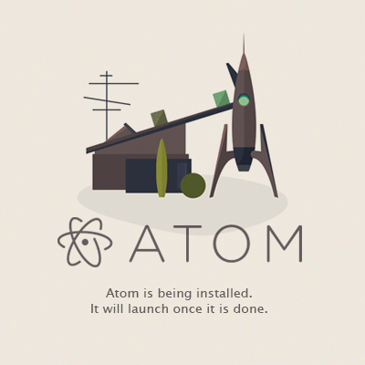
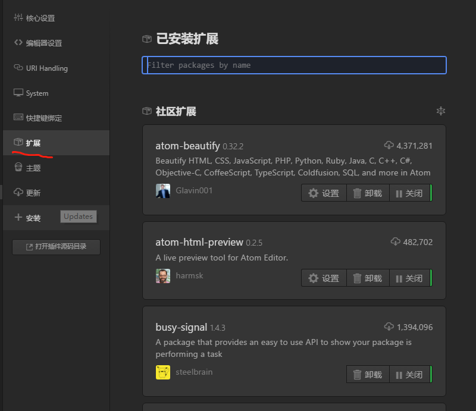
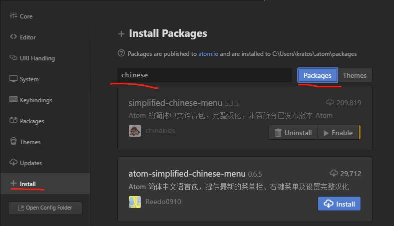

# windows环境下配置简单实用的atom

### 安装atom
1. 到atom的官网下载，这里附上[atom官网](http://atom.io/)
2. 点开安装，自动开始安装，安装在默认路径 C:\Users\kratos\AppData\Local\atom
3. 接下来就是等待

### 配置基本atom
~~如果不配置，则可以将atom仅仅当作一个功能很强大的文本编辑器使用~~
##### 先学会如何安装插件，atom的核心就是各种插件。下面以装汉化包为例。
file -> settings

点install，然后在输入栏输入你要的插件的名字，一般是英文，因为一般汉化包的名字都有个Chinese，所以输入Chinese，可以点击package搜索，也可以直接回车，我们选择第一个simplified-chinese-menu，因为这个汉化最彻底最完全（插件自己的界面没有汉化别想了），点蓝色的install，等待一会，当出现Uninstall（卸载）说明已经安装成功了，disable是禁用的意思，enable是启用的意思。

安装好后就是中文菜单了

拓展那里就是你已经安装了的插件（拓展），主题就是atom的皮肤，分为语法主题和外观主题，外观主题是外表看到的界面，语法主题是指你在写代码的时候单词的颜色，不同的语法不同颜色，好的主题可以让你直观看到你代码的结构。

### atom入门配置
#### 使用Atom打造无懈可击的Markdown编辑器
~~这个标题是我偷别人的hhhhhhhhh~~

附上原地址[使用Atom打造无懈可击的Markdown编辑器](https://www.cnblogs.com/libin-1/p/6638165.html)

1.预览增强插件(markdown-preview-plus)

    这个插件比atom自带的markdown-preview更好看，
    但是因为markdown-preview-plus这个插件和atom自带的markdown-preview冲突，
    如果要用前者，先禁用掉后者

2.同步滚动(markdown-scroll-sync)

    这个插件基于markdown-preview，装上重启atom即可使用，
    但是！但是会和上面那个预览增强插件冲突(我搞不懂为啥就不能同时兼容)，
    所以如果想用这个插件，先把上面的卸载掉或者禁用掉，把atom自带的打开，
    然后就可以使用了，这个插件的作用在于你边写markdown文件的时候你如果滚动markdown文件，
    预览的文件也一起滚动，而且还可以跟踪光标，个人觉得在写md的时候这个插件非常实用。

3.代码增强(language-markdown)

    这个插件能给代码着色（虽说本来atom就有，但是有这个更好看），
    还提供了快捷的代码片段生成等功能。

4.图片粘贴(markdown-image-paste)

    这个可能是atom里写markdown最实用的工具了，在别的地方复制一张图片，
    到atom里直接长贴就可以了，它会把这一行的字当作图片的名字，这点稍微注意下就好了，
    它会把粘贴的图片放在和markdown文件同一个文件夹

5.表格编辑(markdown-table-editor)

    写过markdown的人都知道，弄一个表格可以让你哭出来，这个插件就是用来解决这个问题的，
    安装好了之后，你和平时一样，输入 |+空格 然后tab一下，你会发现一个新世界，
    换行直接回车即可，自动替你排版。

## C/C++编译环境
摘自
[Atom安装并配置C/C++开发环境](http://blog.csdn.net/qq_36731677/article/details/54609583)
